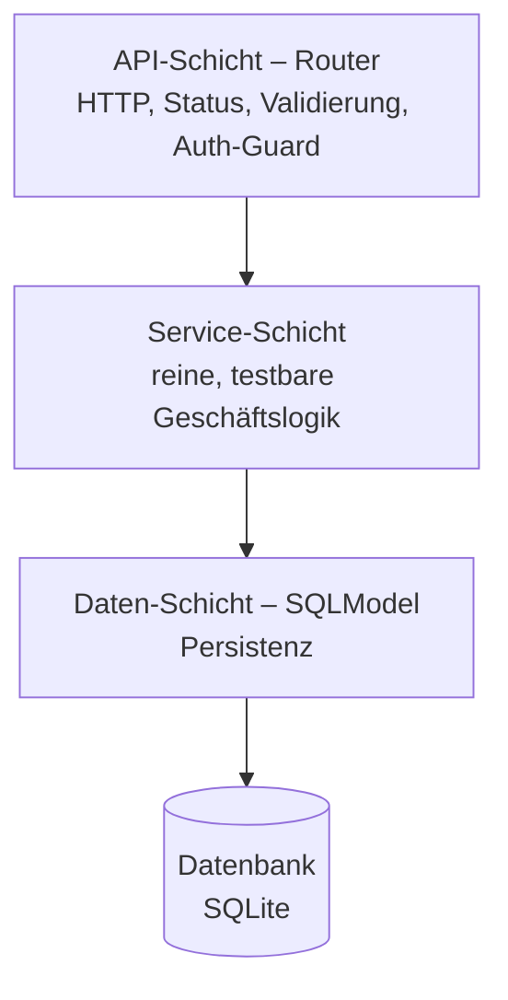
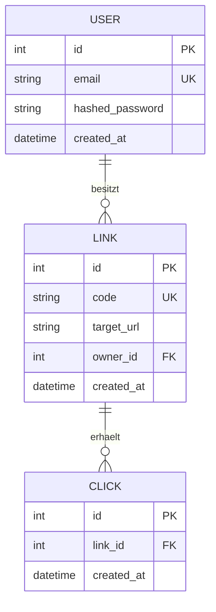

# URL-Shortener


ATL-#1-Softwareprojekt (HE24, PE-A): ein URL-Shortener mit Benutzerkonten,
JWT-Authentifizierung und Klick-Statistik, gebaut mit FastAPI und SQLModel.

> Dieses README ist ein *living document* und wächst mit jedem Feature mit.

## 1. Kurzbeschreibung

Der Dienst verkürzt lange URLs zu kurzen Codes. Registrierte Benutzer verwalten
ihre eigenen Kurzlinks (owner-scoped), jeder Aufruf eines Kurzlinks wird gezählt
und lässt sich pro Tag auswerten. Die Weiterleitung selbst ist öffentlich.

## 2. Anleitung: Start, Test, Nutzung

Voraussetzung: Python 3.14.

```bash
# Virtuelle Umgebung und Abhängigkeiten
python3 -m venv .venv
source .venv/bin/activate
pip install -r requirements.txt

# Konfiguration anlegen (Werte anpassen)
cp .env.example .env

# Anwendung starten
uvicorn app.main:app --reload
```

- API-Dokumentation (Swagger UI): <http://localhost:8000/docs>
- Health-Check: <http://localhost:8000/health>

Tests und Qualitätsprüfung:

```bash
pytest --cov=app --cov-branch   # Tests mit Branch-Coverage
ruff check .                    # Linting
ruff format .                   # Formatierung
```

## 3. Komponenten

| Modul | Aufgabe |
|---|---|
| `app/config.py` | Zentrale Einstellungen aus `.env` (DB-URL, Base-URL, Code-Länge, JWT-Secret, Token-Ablauf) |
| `app/database.py` | Engine, Tabellen-Initialisierung und `get_session`-Dependency |
| `app/models.py` | SQLModel-Tabellen `User`, `Link`, `Click` inkl. Beziehungen und `created_at` |
| `app/schemas.py` | Request-/Response-Schemas mit `HttpUrl`-Validierung |
| `app/security.py` | Passwort-Hashing (bcrypt), JWT erstellen/prüfen, `get_current_user` |
| `app/routers/auth.py` | Registrierung, Login (JWT) und `GET /api/auth/me` |
| `app/routers/links.py` | Owner-scoped CRUD für Kurzlinks (`/api/links`) |
| `app/services/shortcode.py` | Eindeutige Kurzcodes erzeugen, Wunsch-Aliase per Regex prüfen |
| `app/main.py` | FastAPI-App, Lifespan (Tabellen-Init), Router-Registrierung, Health-Check |

*(wächst pro Feature: Redirect, Statistik)*

## 4. Architektur

Drei Schichten mit Abhängigkeitsrichtung nur von oben nach unten. Die
Service-Schicht kennt kein HTTP; Authentifizierung ist eine Querschnittsfunktion
der API-Schicht.



### Datenmodell (ER)



- **User 1:n Link** – ein User besitzt beliebig viele Kurzlinks (owner-scoped).
- **Link 1:n Click** – jeder Aufruf erzeugt einen Klick-Datensatz mit Zeitstempel;
  beim Löschen eines Links werden seine Klicks mitentfernt (`cascade`).
- `created_at` auf allen Tabellen – Grundlage für die Tages-Statistik (F7).

## 5. Überlegungen zum Projekt (Entscheidungen & Trade-offs)

- **FastAPI + SQLModel** statt Flask/SQLAlchemy pur: Typsicherheit, automatische
  Validierung und Swagger-Dokumentation; entspricht dem Unterrichtsstoff.
- **SQLite**: genügt für Umfang und Tests (In-Memory pro Test); migrierbar auf
  PostgreSQL über dieselbe ORM-Schicht.
- **Schichtenarchitektur**: Geschäftslogik bleibt HTTP-frei und damit als reine
  Funktion testbar.
- **TDD mit 100 % Branch-Coverage**: Tests beschreiben Verhalten, nicht
  Implementierung.
- **JWT (HS256) statt Server-Sessions**: zustandslose Authentifizierung, passend
  für eine API; Passwörter ausschliesslich als bcrypt-Hash, Secret nur aus `.env`.
- **OAuth2-Password-Flow** beim Login: integriert sich nahtlos in den
  „Authorize"-Knopf der Swagger UI (Login → Token → geschützter Aufruf).
- **`secrets` statt `random`** für Kurzcodes: kryptografisch nicht vorhersagbar;
  Kollisionen werden gegen die DB geprüft und neu gewürfelt.
- **Owner-Scoping** aller Link-Endpunkte: fremde Links sind nicht sichtbar oder
  löschbar (`404` unbekannt, `403` fremd).
- **Open-Redirect-Schutz**: `HttpUrl` erzwingt ausschliesslich `http`/`https`
  und ein Längenlimit; ungültige Ziel-URLs werden früh abgewiesen.

*(wächst pro Feature, u. a.: REST statt SOAP/GraphQL, 307 statt 301.)*

## 6. Was würde ich mit mehr Zeit verbessern

- PostgreSQL mit Alembic-Migrationen statt `create_all`.
- Live-Klick-Statistik über WebSockets.
- Mutation Testing zur Bewertung der Testqualität.

*(wird zum Projektabschluss vervollständigt.)*
