# URL-Shortener


ATL-#1-Softwareprojekt (HE24, PE-A): ein URL-Shortener mit Benutzerkonten,
JWT-Authentifizierung und Klick-Statistik, gebaut mit FastAPI und SQLModel.
Das Web-Frontend ist eine Vue-3-SPA mit Tailwind CSS (Verzeichnis `frontend/`).

## 1. Kurzbeschreibung

Der Dienst verkürzt lange URLs zu kurzen Codes. Registrierte Benutzer verwalten
ihre eigenen Kurzlinks (owner-scoped), jeder Aufruf eines Kurzlinks wird gezählt
und lässt sich pro Tag auswerten. Die Weiterleitung selbst ist öffentlich.

## 2. Anleitung: Start, Test, Nutzung

Voraussetzung: Python 3.14.

```bash
# Virtuelle Umgebung und Abhängigkeiten
python3 -m venv .venv
source .venv/bin/activate
pip install -r requirements.txt

# Konfiguration anlegen und Werte anpassen.
# SECRET_KEY ist Pflicht – ohne gesetzten Wert startet die App bewusst nicht.
cp .env.example .env

# Anwendung starten
uvicorn app.main:app --reload
```

- API-Dokumentation (Swagger UI): <http://localhost:8000/docs>
- Health-Check: <http://localhost:8000/health>

### Typischer Ablauf

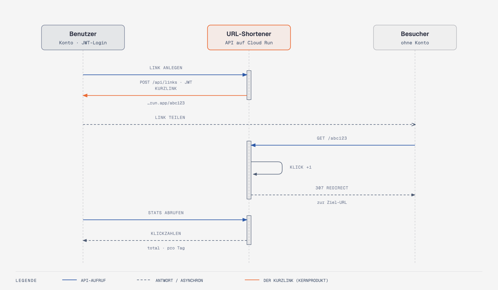

Der Benutzer registriert sich, meldet sich an (JWT) und legt Kurzlinks an. Besucher
rufen `/{code}` öffentlich auf – jeder Aufruf wird per `307` weitergeleitet und gezählt
und fliesst in die Statistik ein. In der Swagger UI führt der „Authorize"-Knopf den
Login-Flow aus und hängt das Token automatisch an die geschützten Aufrufe.

Tests und Qualitätsprüfung:

```bash
pytest --cov=app --cov-branch   # Tests mit Branch-Coverage
ruff check .                    # Linting
ruff format .                   # Formatierung
```

### Frontend

Das Web-Frontend liegt unter `frontend/` (Vue 3 + Vite + Tailwind). Es spricht die
laufende API an (CORS ist dafür vorbereitet):

```bash
cd frontend
npm install
npm run dev   # http://localhost:5173
```

Details siehe [`frontend/README.md`](frontend/README.md).

## 3. Komponenten

| Modul | Aufgabe |
|---|---|
| `app/config.py` | Zentrale Einstellungen aus `.env` (DB-URL, Base-URL, Code-Länge, JWT-Secret, Token-Ablauf) |
| `app/database.py` | Engine, Tabellen-Initialisierung und `get_session`-Dependency |
| `app/models.py` | SQLModel-Tabellen `User`, `Link`, `Click` inkl. Beziehungen und `created_at` |
| `app/schemas.py` | Request-/Response-Schemas mit `HttpUrl`-Validierung |
| `app/security.py` | Passwort-Hashing (bcrypt), JWT erstellen/prüfen, `get_current_user` |
| `app/routers/auth.py` | Registrierung, Login (JWT) und `GET /api/auth/me` |
| `app/routers/links.py` | Owner-scoped CRUD für Kurzlinks (`/api/links`) |
| `app/routers/redirect.py` | Öffentliche Weiterleitung `GET /{code}` (307) mit Klick-Erfassung |
| `app/routers/stats.py` | Klick-Statistik `GET /api/links/{code}/stats` (auth, nur eigene) |
| `app/services/shortcode.py` | Eindeutige Kurzcodes erzeugen, Wunsch-Aliase per Regex prüfen |
| `app/services/stats.py` | Klicks aggregieren (gesamt und pro Tag) |
| `app/main.py` | FastAPI-App, Lifespan (Tabellen-Init), Router-Registrierung, Health-Check |

### API-Endpunkte

| Methode | Pfad | Auth | Zweck | Statuscodes |
|---|---|---|---|---|
| `POST` | `/api/auth/register` | – | Benutzer registrieren | `201`, `409` |
| `POST` | `/api/auth/login` | – | Login, JWT ausgeben | `200`, `401` |
| `GET` | `/api/auth/me` | ✔ | Aktuellen Benutzer abrufen | `200`, `401` |
| `POST` | `/api/links` | ✔ | Kurzlink anlegen | `201`, `400`, `401`, `409`, `422` |
| `GET` | `/api/links` | ✔ | Eigene Kurzlinks auflisten | `200`, `401` |
| `GET` | `/api/links/{code}` | ✔ | Eigenen Kurzlink lesen | `200`, `401`, `403`, `404` |
| `DELETE` | `/api/links/{code}` | ✔ | Eigenen Kurzlink löschen | `204`, `401`, `403`, `404` |
| `GET` | `/api/links/{code}/stats` | ✔ | Klick-Statistik | `200`, `401`, `403`, `404` |
| `GET` | `/{code}` | – | Weiterleitung + Klick | `307`, `404` |
| `GET` | `/health` | – | Betriebszustand | `200` |

## 4. Architektur

Drei Schichten mit Abhängigkeitsrichtung nur von oben nach unten. Die
Service-Schicht kennt kein HTTP; Authentifizierung ist eine Querschnittsfunktion
der API-Schicht. Das Vue-Frontend (`frontend/`) ist ein eigenständiger Client, der
die REST-API über JWT konsumiert.

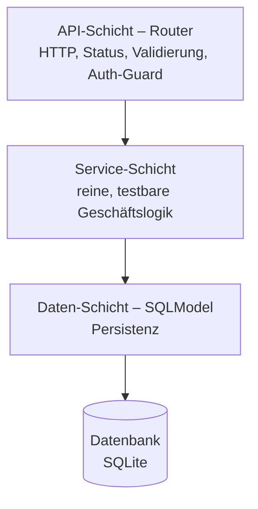
```mermaid
flowchart TD
    A["API-Schicht – Router<br/>HTTP, Status, Validierung, Auth-Guard"] --> B["Service-Schicht<br/>reine, testbare Geschäftslogik"]
    B --> C["Daten-Schicht – SQLModel<br/>Persistenz"]
    C --> D[("Datenbank<br/>SQLite")]
```

### Datenmodell (ER)

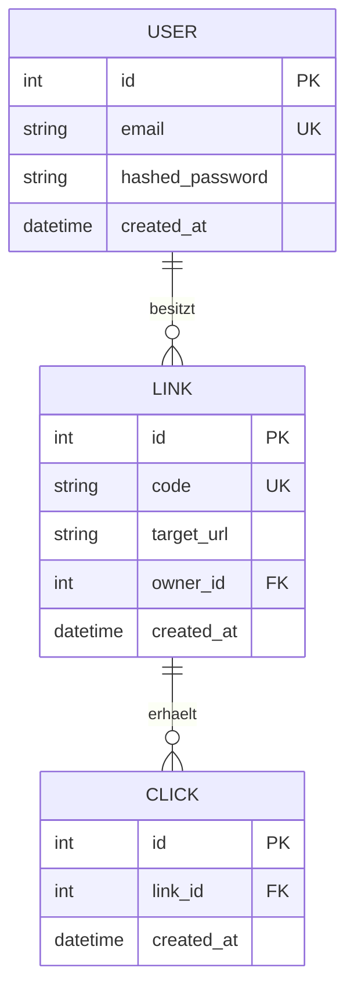
```mermaid
erDiagram
    USER ||--o{ LINK : besitzt
    LINK ||--o{ CLICK : erhaelt
    USER {
        int id PK
        string email UK
        string hashed_password
        datetime created_at
    }
    LINK {
        int id PK
        string code UK
        string target_url
        int owner_id FK
        datetime created_at
    }
    CLICK {
        int id PK
        int link_id FK
        datetime created_at
    }
```

- **User 1:n Link** – ein User besitzt beliebig viele Kurzlinks (owner-scoped).
- **Link 1:n Click** – jeder Aufruf erzeugt einen Klick-Datensatz mit Zeitstempel;
  beim Löschen eines Links werden seine Klicks mitentfernt (`cascade`).
- `created_at` auf allen Tabellen – Grundlage für die Tages-Statistik (F7).

## 5. Überlegungen zum Projekt (Entscheidungen & Trade-offs)

- **REST statt SOAP/GraphQL**: ressourcenorientierte Endpunkte mit HTTP-Statuscodes
  passen zum überschaubaren, klar abgegrenzten Domänenmodell; SOAP wäre zu schwergewichtig,
  GraphQL für diesen Umfang überdimensioniert.
- **FastAPI + SQLModel** statt Flask/SQLAlchemy pur: Typsicherheit, automatische
  Validierung und Swagger-Dokumentation; entspricht dem Unterrichtsstoff.
- **SQLite**: genügt für Umfang und Tests (In-Memory pro Test); migrierbar auf
  PostgreSQL über dieselbe ORM-Schicht.
- **Schichtenarchitektur**: Geschäftslogik bleibt HTTP-frei und damit als reine
  Funktion testbar.
- **TDD mit 100 % Branch-Coverage**: Tests beschreiben Verhalten, nicht
  Implementierung.
- **JWT (HS256) statt Server-Sessions**: zustandslose Authentifizierung, passend
  für eine API; Passwörter ausschliesslich als bcrypt-Hash, Secret nur aus `.env`.
- **OAuth2-Password-Flow** beim Login: integriert sich nahtlos in den
  „Authorize"-Knopf der Swagger UI (Login → Token → geschützter Aufruf).
- **`secrets` statt `random`** für Kurzcodes: kryptografisch nicht vorhersagbar;
  Kollisionen werden gegen die DB geprüft und neu gewürfelt.
- **Owner-Scoping** aller Link-Endpunkte: fremde Links sind nicht sichtbar oder
  löschbar (`404` unbekannt, `403` fremd).
- **Open-Redirect-Schutz**: `HttpUrl` erzwingt ausschliesslich `http`/`https`
  und ein Längenlimit; ungültige Ziel-URLs werden früh abgewiesen.
- **307 statt 301** bei der Weiterleitung: kein dauerhaftes Browser-Caching, damit
  jeder Aufruf den Server erreicht und korrekt gezählt wird. Die Catch-all-Route
  `GET /{code}` wird zuletzt registriert, damit `/health`, `/docs` und `/api/…`
  Vorrang behalten.
- **Aggregation in der Service-Schicht**: die Tages-Statistik ist eine reine
  Funktion über die Klick-Datensätze und dadurch unabhängig von HTTP testbar; die
  Owner-Prüfung ist eine geteilte FastAPI-Dependency (`get_owned_link`).

Die Entscheidungen zum Cloud-Deployment (Artifact Registry statt Container
Registry, Deploy-Gate auf `main`, Secret Manager, ephemeres SQLite) sind in
Kapitel 7 direkt bei den jeweiligen Schritten begründet.

## 6. Was würde ich mit mehr Zeit verbessern

- **Persistente Datenbank (Cloud SQL/PostgreSQL).** Die grösste Schwäche des
  aktuellen Betriebs: SQLite lebt im Container-Dateisystem und geht bei jedem
  Redeploy verloren. Dank der ORM-Schicht (SQLModel) wäre die Migration klein –
  im Kern eine andere `DATABASE_URL` plus ein Cloud-SQL-Anschluss am
  Cloud-Run-Dienst; danach dürfte auch `--max-instances` über 1 steigen.
- **Alembic-Migrationen statt `create_all`.** Versionierte Schemaänderungen
  machen spätere Modell-Anpassungen im Live-Betrieb nachvollziehbar und
  rückrollbar.
- **Staging-Umgebung.** Ein zweiter Cloud-Run-Dienst (z. B. `url-shortener-staging`),
  auf den Feature-Branches deployen – dann liesse sich jede Änderung vor dem
  Merge unter Produktionsbedingungen anschauen.
- **Frontend-Tests in Cloud Build.** Heute prüft die Pipeline das Frontend nur
  über den Vite-Build im Docker-Image; die Vitest-Unit-Tests laufen in GitHub
  Actions. Ein eigener Cloud-Build-Schritt würde beide Prüfungen an einem Ort
  bündeln – um den Preis längerer Builds.
- **Monitoring und Alarme.** Ein Uptime-Check auf `/health` plus eine
  Benachrichtigung bei Fehlerraten würde Ausfälle melden, bevor es Benutzer tun.
- **Live-Klick-Statistik über WebSockets** (Unterrichtsthema Woche 18) – Klicks
  erscheinen in Echtzeit im Dashboard statt erst beim Neuladen.
- **Mutation Testing (`mutmut`).** 100 % Coverage sagt, *dass* jede Zeile lief –
  Mutation Testing würde zeigen, ob die Tests Fehler auch wirklich fangen.

## 7. Cloud-Deployment (ATL #2)

Dieses Kapitel dokumentiert Schritt für Schritt, wie der URL-Shortener in die
Google Cloud kam: Container (Docker) → Build-Pipeline (Cloud Build) →
Image-Ablage (Artifact Registry) → Betrieb (Cloud Run). Das Zusammenspiel im
Überblick:

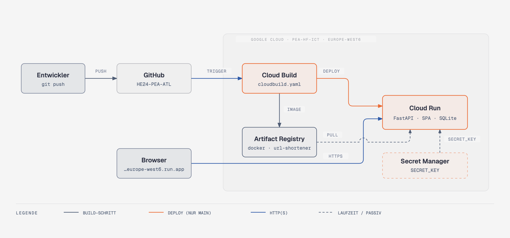

Ein `git push` genügt: GitHub meldet den Push an Cloud Build, die Pipeline prüft
den Code, baut das Docker-Image, legt es in der Artifact Registry ab und stellt
es als neue Cloud-Run-Revision live. Das JWT-Secret kommt zur Laufzeit aus dem
Secret Manager; Benutzer erreichen die App öffentlich per HTTPS.

> **Live:** <https://url-shortener-204941757946.europe-west6.run.app> –
> Web-App unter `/app/`, Swagger UI unter `/docs`, Health-Check unter `/health`.

### 7.1 Containerisierung (Docker)

**Docker kurz erklärt:** Docker verpackt eine Anwendung samt Laufzeitumgebung und
Abhängigkeiten in ein *Image* – ein unveränderliches Abbild, aus dem sich beliebig
viele *Container* (isolierte Prozesse) starten lassen. Für Deployments ist das
zentral: dasselbe Image, das lokal getestet wurde, läuft unverändert in der Cloud –
Umgebungsunterschiede („läuft nur auf meinem Laptop") entfallen.

Die wichtigsten Dockerfile-Anweisungen, erklärt am eigenen [`Dockerfile`](Dockerfile):

| Anweisung | Zweck | Einsatz im Projekt |
|---|---|---|
| `FROM` | Basis-Image festlegen | zweistufig: `node:22-alpine` baut das Frontend, `python:3.14-slim` führt die API aus |
| `WORKDIR` | Arbeitsverzeichnis im Image | `/build` (Build-Stufe) bzw. `/srv` (Laufzeit) |
| `COPY` | Dateien ins Image kopieren | `COPY --from=frontend` übernimmt nur das Build-Ergebnis (`dist/`) der ersten Stufe |
| `RUN` | Befehl beim Bauen ausführen | `npm ci` + Vite-Build, `pip install` |
| `ENV` | Umgebungsvariable setzen | `VITE_API_BASE_URL=""` (same-origin), `FRONTEND_DIST` (aktiviert die SPA-Auslieferung) |
| `EXPOSE` | Container-Port dokumentieren | `8080` |
| `CMD` | Startbefehl des Containers | `uvicorn`, respektiert die von Cloud Run gesetzte Variable `PORT` |

**Multi-Stage-Build:** Stufe 1 baut die Vue-SPA mit `--base=/app/` und leerer
API-Basis-URL (die SPA spricht die API same-origin an), Stufe 2 installiert die
FastAPI-Anwendung und übernimmt nur das fertige `dist/`. Ergebnis ist **ein** Image,
das unter einer Adresse alles ausliefert:

- `/app/` – Web-Frontend (SPA); unbekannte Pfade fallen auf die `index.html` zurück,
  damit Deep-Links des History-Routers funktionieren. `/` leitet auf `/app/` um.
- `/api/…`, `/docs`, `/health` – API wie gehabt.
- `/{code}` – öffentliche Weiterleitung; Wunsch-Aliase, die mit eigenen Routen
  kollidieren würden (`app`, `docs`, `redoc`, `health`), sind seit diesem Schritt reserviert.

Lokal bauen, starten und prüfen:

```bash
docker build -t url-shortener .
docker run -p 8080:8080 -e SECRET_KEY=ein-langes-zufälliges-secret url-shortener
# http://localhost:8080/app/ (Web-App) · /docs (Swagger UI) · /health
```

**Herausforderung:** Der Aufruf `npm run build -- --base=/app/` reichte `--base`
über das `npm-run-all`-Script nicht an Vite weiter – die Asset-Pfade zeigten auf
`/assets/…` statt `/app/assets/…`, und das Frontend blieb im Container leer.
Lösung: `type-check` und `vite build` werden im Dockerfile getrennt aufgerufen.

### 7.2 Cloud-Setup (Google Cloud)

Alle Schritte laufen im GCP-Projekt `pea-hf-ict`, Region `europe-west6` (Zürich –
Datenstandort Schweiz, geringe Latenz).

**Warum Cloud Run?** Google bietet vier Wege, einen Dienst zu betreiben – sie
unterscheiden sich vor allem darin, wie viel Infrastruktur man selbst verwalten
muss:

| Dienst | Modell | Man verwaltet | Komplexität (1–10) |
|---|---|---|---|
| Compute Engine | virtuelle Maschine (IaaS) | OS, Updates, Webserver, Skalierung | 7 |
| Kubernetes Engine | Container-Orchestrierung | Cluster, Nodes, Manifeste | 9 |
| **Cloud Run** | Container als Service (PaaS) | nur das Container-Image | **3** |
| Cloud Functions | einzelne Funktionen (FaaS) | nur Funktions-Code | 2 |

Cloud Functions wäre noch einfacher, passt aber nicht: Diese Anwendung ist eine
zusammenhängende FastAPI-App mit eigenem Routing und statischem Frontend, keine
Sammlung einzelner Funktionen. Cloud Run nimmt genau das Docker-Image aus F12
entgegen, skaliert automatisch (auch auf null – keine Kosten ohne Traffic) und
verlangt weder VM-Pflege noch ein Kubernetes-Cluster. Für ein containerisiertes
Einzelprojekt ist es der passendste Dienst – und der von der Aufgabenstellung
vorgesehene.

**Kostenkontrolle zuerst.** Bevor irgendein Dienst läuft, begrenzt ein Budget das
Risiko: 5 CHF pro Monat, E-Mail-Alarm bei 50 %, 90 % und 100 % der Summe. Alle
verwendeten Dienste bleiben im Free Tier (Cloud Build 120 Build-Minuten/Tag,
Cloud Run 2 Mio. Requests/Monat, Artifact Registry unter 0.5 GB) – das Budget ist
das Sicherheitsnetz, falls doch etwas Kosten verursacht.

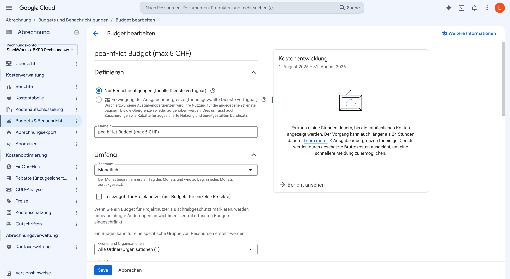

```bash
gcloud billing budgets create --billing-account=<KONTO-ID> \
  --display-name="pea-hf-ict Budget (max 5 CHF)" --budget-amount=5CHF \
  --filter-projects=projects/<PROJEKTNUMMER> \
  --threshold-rule=percent=0.5 --threshold-rule=percent=0.9 --threshold-rule=percent=1.0
```

**Benötigte APIs aktivieren.** Cloud Build und Artifact Registry waren im Projekt
bereits aktiv; für den Betrieb kamen Cloud Run und Secret Manager dazu:

```bash
gcloud services enable run.googleapis.com secretmanager.googleapis.com
```

**Artifact Registry statt Container Registry.** Die Aufgabenstellung nennt die
*Container Registry* (`gcr.io`) – diese ist von Google abgekündigt und abgeschaltet;
die **Artifact Registry** ist ihr offizieller Nachfolger und übernimmt dieselbe Rolle
in der Pipeline (Ablage der Docker-Images). Das Repository:

```bash
gcloud artifacts repositories create url-shortener \
  --repository-format=docker --location=europe-west6
```

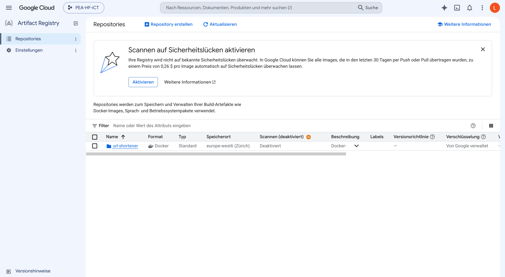

**Secret Manager für das JWT-Secret.** `SECRET_KEY` steht weder im Repo noch in der
Pipeline-Definition: Der Wert liegt als Secret `url-shortener-secret-key` im Secret
Manager, und Cloud Run reicht ihn der App zur Laufzeit als Umgebungsvariable weiter
(gleiches Prinzip wie lokal mit `.env` – Secrets bleiben ausserhalb der Versionierung).

```bash
printf '%s' "<zufälliges-secret>" | gcloud secrets create url-shortener-secret-key --data-file=-
```

**IAM-Rollen.** Cloud Build baut und deployt mit dem Standard-Compute-Service-Account;
dieser braucht genau die folgenden Rollen:

| Rolle | Zweck |
|---|---|
| `roles/artifactregistry.writer` | Images in die Registry pushen |
| `roles/run.admin` | Cloud-Run-Dienst deployen |
| `roles/iam.serviceAccountUser` | beim Deploy als Laufzeit-Service-Account agieren |
| `roles/secretmanager.secretAccessor` | das JWT-Secret zur Laufzeit lesen |
| `roles/logging.logWriter` | Build-Logs schreiben |

### 7.3 CI/CD-Pipeline (Cloud Build)

Die Pipeline ist in [`cloudbuild.yaml`](cloudbuild.yaml) definiert und entstand in
drei nachvollziehbaren Schritten (siehe Commit-Historie): zuerst nur die Tests,
dann Image-Build und Registry-Push, zuletzt das Deployment.

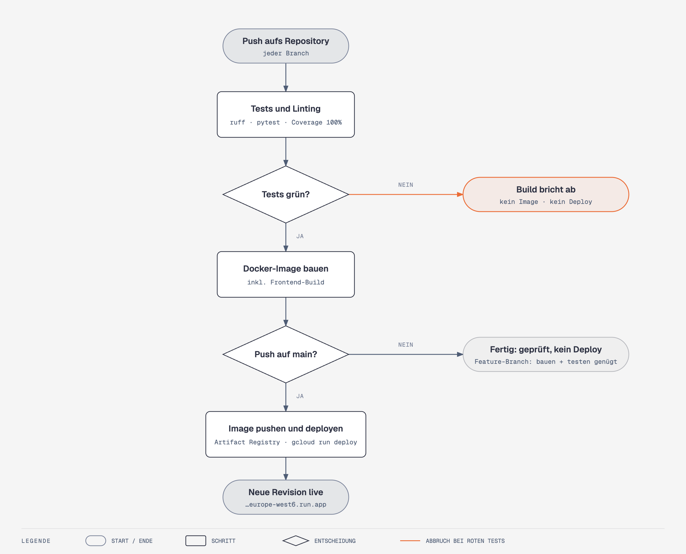

**Ablauf bei jedem Push** – der Cloud-Build-Trigger reagiert auf Pushes auf
*alle* Branches:

| Schritt | Was passiert | Wo |
|---|---|---|
| `tests` | Ruff (Lint + Format-Check) und pytest mit `--cov-fail-under=100` | jeder Push |
| `image-bauen` | Docker-Image bauen – baut dabei die SPA und validiert sie mit | jeder Push |
| `image-pushen` | Image mit Commit-SHA- und `latest`-Tag in die Artifact Registry | nur `main` |
| `deployen` | `gcloud run deploy` mit dem frischen Image; `SECRET_KEY` kommt aus dem Secret Manager | nur `main` |

Schlägt ein Schritt fehl, bricht Cloud Build den Build an dieser Stelle ab – bei
roten Tests wird also weder ein Image gebaut noch irgendetwas deployed
(Nachweis in Abschnitt 7.4).

Der Trigger ist mit dem GitHub-Repository verbunden und reagiert auf jeden Push:

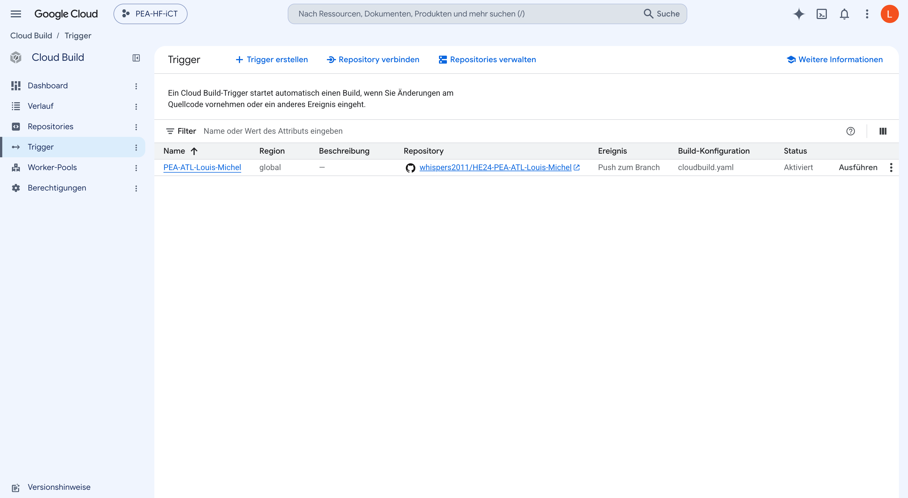

Ein erfolgreicher Durchlauf auf `main` – alle vier Schritte grün, am Ende steht
die neue Revision live:

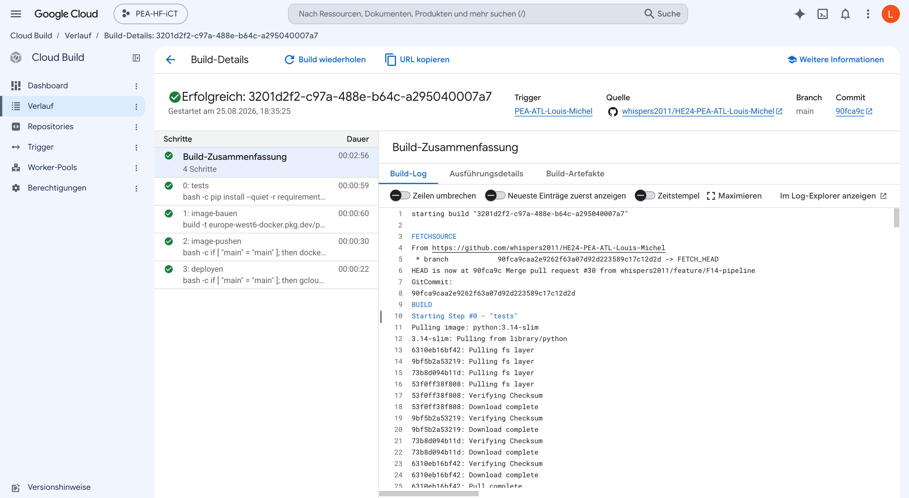

Das gebaute Image liegt mit Commit-SHA- und `latest`-Tag in der Artifact Registry:

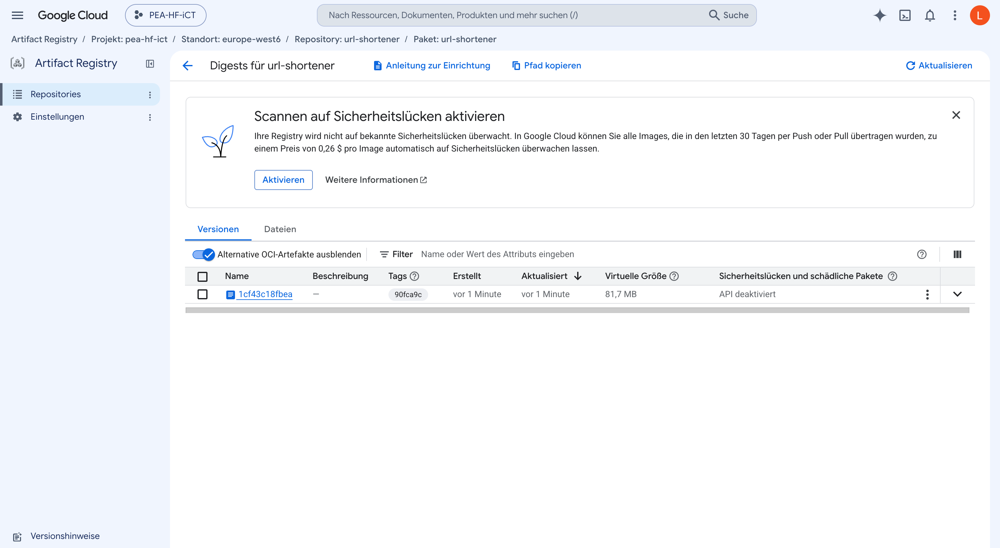

Der Cloud-Run-Dienst mit öffentlicher URL:

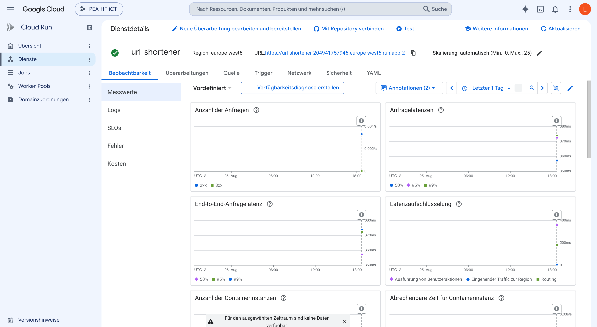

Die deployte Anwendung im Browser (Login-Ansicht der SPA):

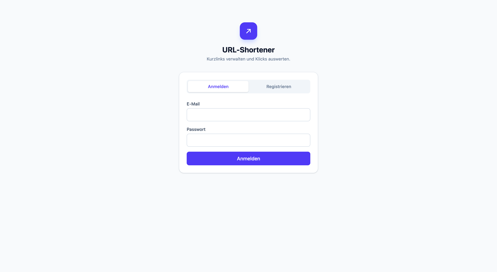

**Warum deployen nur von `main`?** Die Pipeline läuft „bei jedem Push", aber
Feature-Branches werden nur gebaut und getestet. Live geht ausschliesslich der
Stand, der es durch Review und grüne CI nach `main` geschafft hat – `main` bleibt
damit der einzige deploybare, jederzeit lauffähige Stand (gleiches Prinzip wie in
ATL #1).

**Erster Deploy und `BASE_URL`.** Nach dem ersten Deployment wird die öffentliche
Cloud-Run-URL einmalig als Umgebungsvariable gesetzt, damit die API ihre
Kurz-URLs mit der Live-Domain ausgibt (bleibt für alle folgenden Revisionen
erhalten):

```bash
gcloud run services update url-shortener --region europe-west6 \
  --update-env-vars BASE_URL=https://<cloud-run-url>
```

**Datenhaltung (bewusster Trade-off).** Die SQLite-Datenbank liegt im
Container-Dateisystem von Cloud Run und ist damit *ephemer*: Bei einem Redeploy
oder Neustart der Instanz gehen die Daten verloren. Für diesen Nachweis genügt
das; `--max-instances 1` hält den Zustand konsistent. Der Weg zu persistenten
Daten (Cloud SQL/PostgreSQL – dieselbe ORM-Schicht macht die Migration klein)
steht unter „Was würde ich mit mehr Zeit verbessern".

### 7.4 Fehlschlag-Nachweis: rote Tests stoppen das Deployment

Pflichtnachweis der Aufgabenstellung: Was macht Cloud Build, wenn ein Test
fehlschlägt? Dazu wurde auf dem Branch
[`demo/failing-test`](https://github.com/whispers2011/HE24-PEA-ATL-Louis-Michel/tree/demo/failing-test)
(bleibt als Beleg bestehen und wird nie gemergt) genau eine Erwartung verändert:
`test_health_returns_ok` verlangt dort den Statuscode `418` statt `200`.

Der Push löste die Pipeline aus – mit dem erwarteten Ergebnis:

- Schritt `tests` schlägt fehl:
  `FAILED tests/integration/test_health.py::test_health_returns_ok` –
  `1 failed, 76 passed`.
- Cloud Build **bricht den Build an dieser Stelle ab**: Die Folgeschritte
  `image-bauen`, `image-pushen` und `deployen` wurden gar nie gestartet
  (Status «–» in den Build-Details).
- Es entstand **kein neues Image** in der Registry, und die Cloud-Run-Revision
  blieb unverändert – die zuletzt geprüfte Version läuft ungestört weiter.

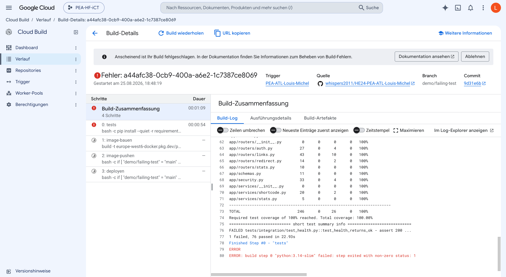

Der Build-Verlauf zeigt den Kontrast: grüne Durchläufe auf `main` (mit Deploy)
und Feature-Branches, daneben der rote Build des absichtlich gebrochenen Tests:

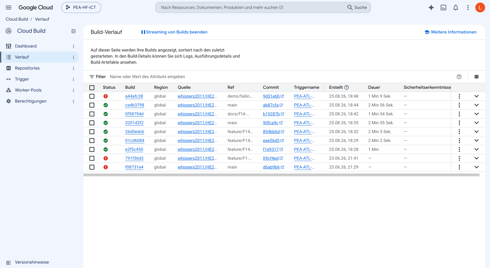

### 7.5 Herausforderungen unterwegs

- **Vite bekam `--base` nicht zu sehen.** `npm run build -- --base=/app/` reichte
  das Flag über das `npm-run-all`-Script nicht an Vite weiter – die SPA lud ihre
  Assets von `/assets/…` statt `/app/assets/…` und blieb im Container leer.
  Lösung: `type-check` und `vite build` im Dockerfile getrennt aufrufen (7.1).
- **Container Registry gibt es nicht mehr.** Die Aufgabenstellung nennt die
  Container Registry; Google hat sie abgeschaltet. Der Wechsel auf die Artifact
  Registry war unumgänglich und ist in 7.2 begründet – Rolle und Handhabung in
  der Pipeline sind identisch.
- **SPA-Routing gegen die Catch-all-Route.** `GET /{code}` fängt jeden Pfad –
  auch `/app`. Das SPA-Mount muss deshalb vor dem Redirect-Router registriert
  werden, Deep-Links brauchen einen `index.html`-Fallback, und Aliase wie `app`
  oder `docs` sind seither als Wunsch-Codes gesperrt (7.1).
- **Eigener Service-Account verlangt eine Logging-Entscheidung.** Der Trigger
  baut mit dem Compute-Service-Account; ohne `options: logging: CLOUD_LOGGING_ONLY`
  verweigert Cloud Build den Start. Dazu brauchte der Account gezielte
  IAM-Rollen (7.2) – nicht mehr und nicht weniger.
- **Ephemeres SQLite.** Im Container gehen Daten bei jedem Redeploy verloren.
  Für den Nachweis akzeptiert (`--max-instances 1`, dokumentiert in 7.3); der
  saubere Ausweg steht in Kapitel 6.
